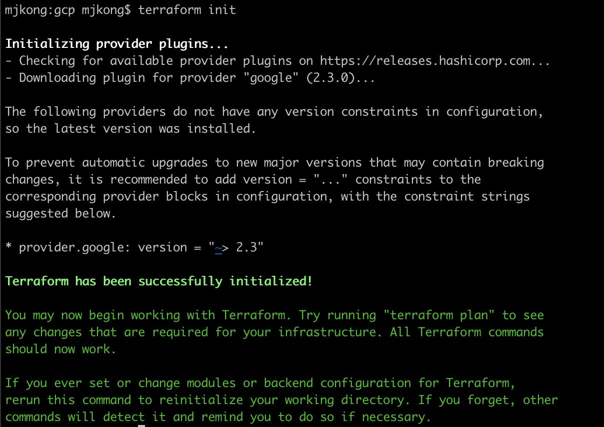

# Manage VMs on GCP by terraform

## 1 GCP 서비스 계정 및 Credentials 설정

## 1 GCP Provider 설정

## 1.1 GCP 서비스 계정 및 Credentials 설정

~~~shell
provider "google" {
  credentials = "${file("mjprod01-67408c308a64.json")}"
  project = "mjprod01-192512"
  region  = "asia-northeast1-b"
  zone    = "asia-northeast1-b"
}
~~~

## 2 Terraform 초기화

~~~shell
terraform init
~~~

